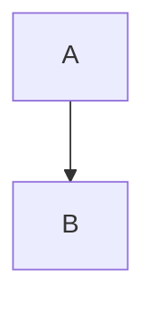

```rust
fn main() {
	let tab = "indented with a tab";
	println!("{}", tab); // a comment
}
```

```python title="example.py"
def greet(name):
    return f"Hello, {name}!"  # a comment that makes this line long enough to wrap at eighty
```

```js
const doubled = [1, 2, 3].map((n) => n * 2);
```

```diff
--- a/file.txt
+++ b/file.txt
@@ -1,3 +1,3 @@
 unchanged line
-removed line
+added line
```

```console
$ emde --help
```

```
no language here
```

    indented code
    with two lines



````markdown
```nested
fences
```
````

```text
tabs:	one	two		three
wide: 日本語のテキスト and emoji 👍
```

```
```
